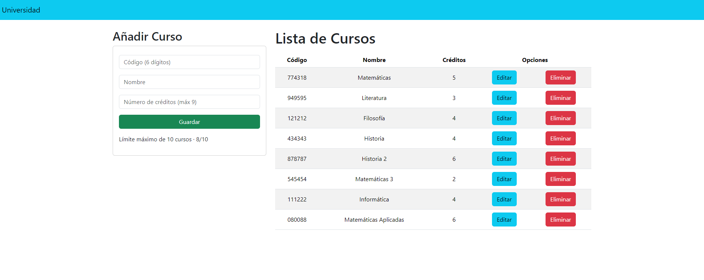

# CRUD con Python, Django y una base de datos PostgreSQL

Gestiona cursos con la función de añadir cursos a una base de datos (con un máximo de 10) y que posteriormente se muestren en una lista de cursos.

Posteriormente podrás borrarlos o editarlos.

## Stack

- Python/Django
- PostgreSQL en AWS
- Bootstrap
- JavaScript

## Link al live:

## Capturas 

